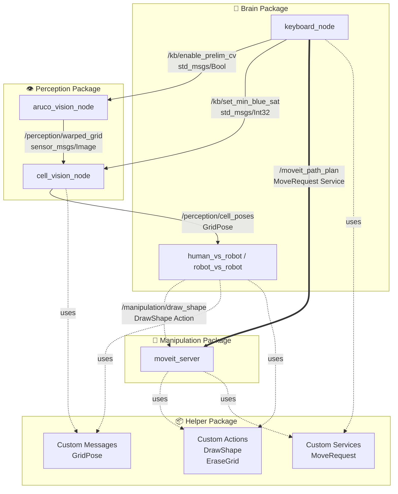
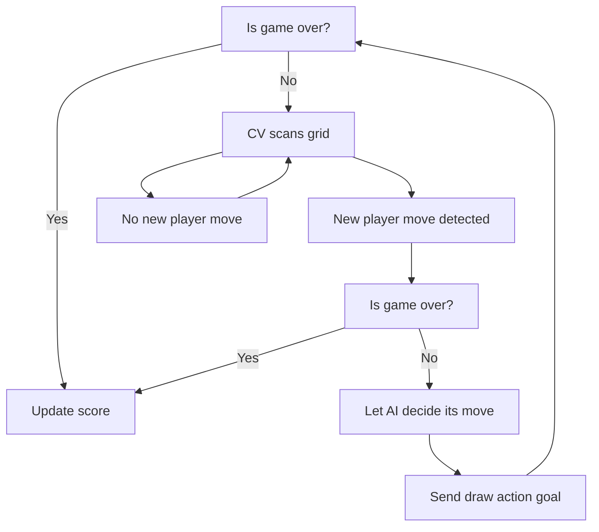
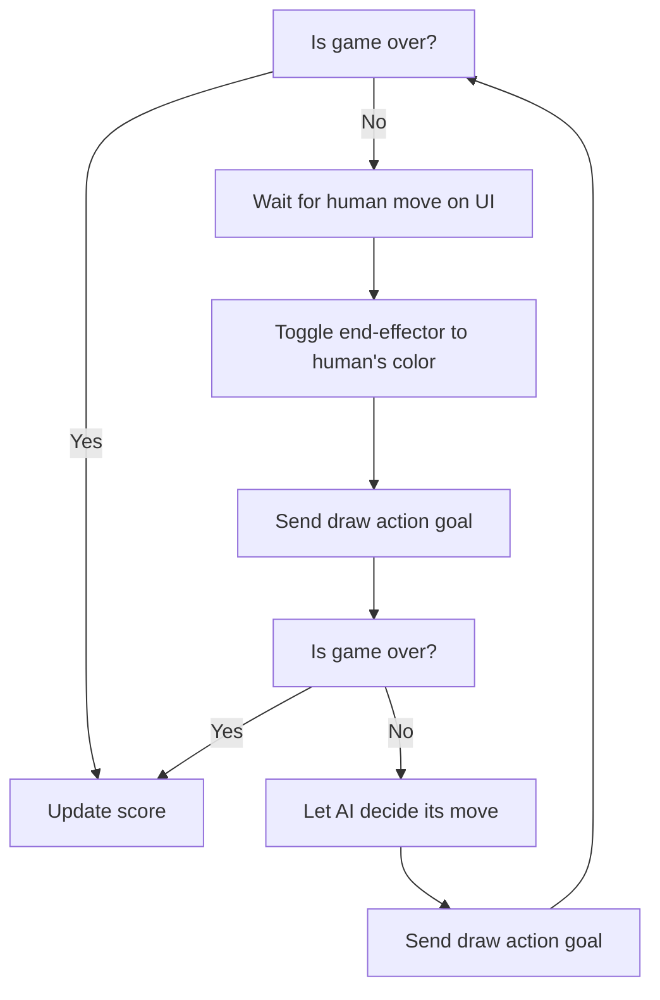

- [Project Overview](#project-overview)
- [System Architecture](#system-architecture)
  - [ROS Architecture](#ros-architecture)
  - [Package-level Architecture](#package-level-architecture)
    - [Package Responsibilities](#package-responsibilities)
  - [Behaviour Tree](#behaviour-tree)
    - [Player vs. Robot Game Mode](#player-vs-robot-game-mode)
    - [Robot vs. Robot Game Mode](#robot-vs-robot-game-mode)
  - [Node Description](#node-description)
  - [Custom Messages](#custom-messages)
- [Technical Components](#technical-components)
  - [Computer Vision](#computer-vision)
  - [Custom End-Effector](#custom-end-effector)
  - [System Visualisation](#system-visualisation)
  - [Closed-Loop Operation](#closed-loop-operation)
- [Installation and Setup](#installation-and-setup)
  - [Hardware Setup](#hardware-setup)
- [Running the System](#running-the-system)
  - [Expected Behaviour](#expected-behaviour)
  - [Keyboard Commands](#keyboard-commands)
  - [Gameplay Instructions](#gameplay-instructions)
    - [Human vs. Robot Mode:](#human-vs-robot-mode)
    - [Robot vs. Robot Mode:](#robot-vs-robot-mode)
  - [Troubleshooting](#troubleshooting)
- [Results and Demo](#results-and-demo)
- [Discussion and Future Work](#discussion-and-future-work)
- [Contributors and Roles](#contributors-and-roles)
- [Repository Structure](#repository-structure)
- [References and Acknowledgements](#references-and-acknowledgements)

## Project Overview
TODO

## System Architecture

### ROS Architecture
TODO

### Package-level Architecture
The system is organised into four main packages that communicate through ROS 2 topics, services, and actions:



#### Package Responsibilities
| package | Purpose | Key Nodes |
|---|---|---|
| `brain` | Game logic, AI decision-making, orchestration | `human_vs_robot`, `robot_vs_robot`, `keyboard_node` |
| `perception` | CV, grid localisation, symbol detection | `aruco_vision_node`, `cell_vision_node` |
| `manipulation` | Motion planning, trajectory execution, drawing | `moveit_server` |
| `helper` | Shared interfaces and message definitions | Custom msg/srv/action types |


### Behaviour Tree

The system behaviour varies slightly depending on which player starts first and the gamemode chosen.

#### Player vs. Robot Game Mode


#### Robot vs. Robot Game Mode


### Node Description
**Brain Package**
- `keyboard_node`: Provides manual control interface via XTerm terminal for toggling logs, adjusting CV parameters, returning robot to home position, and triggering shutdown.
- `human_vs_robot`: Orchestrates human vs. AI gameplay by detecting human moves through CV, coordinating with the MENACE AI agent for robot moves, and managing game state through a Pygame UI.
- `robot_vs_robot`: Enables robot vs. robot gameplay where a human selects moves via mouse clicks for one player while the MENACE AI controls the other player, with both moves executed by the robot arm.

**Manipulation Package**
- `moveit_server`: Motion planning and execution server that handles path planning for drawing X's and O's, erasing the grid (future work), and managing collision avoidance using MoveIt with configurable constraints and trajectory parameters.

**Perception Package**
- `aruco_vision_node`: Detects ArUco markers to establish the grid coordinate frame, broadcasts TF transforms between camera and world frames, and publishes warped top-down grid images for cell detection.
- `cell_vision_node`: Processes warped grid images to detect X (blue) and O (red) symbols in each cell using HSV color filtering, publishes cell poses and states, and visualises detected symbols as RViz markers.

### Custom Messages
**Messages**
- `GridPose`: Contains a header, an array of `Pose2D` representing the center positions and orientations of all 9 grid cells in world coordinates, and an array of color codes indicating cell states (-1 = <span style="color:red">O</span>, 0 = empty, 1 = <span style="color:blue">X</span>).

**Services**
- `MoveRequest`: Service for requesting robot movements with a command type ("cartesian" or "joint"), an array of 6 position values, and a constraints identifier string. Returns a boolean success flag.

**Actions**
- `DrawShape`: Action for drawing X or O symbols on the grid. Takes a `Pose2D` target location, shape string ("X" or "O"), and constraints identifier as goal parameters. Provides status string and progress percentage as feedback, and returns success boolean with message upon completion.

## Technical Components

### Computer Vision
The vision pipeline consists of two stages working in tandem to enable autonomous gameplay:

**Stage 1 - Grid Localisation (ArUco Vision)**
- Detects four ArUco markers positioned at the corners of the physical tic-tac-toe grid
- Computes the grid's center position (X / Y) and 2D rotation (yaw) using camera intrinsics and marker geometry
- Broadcasts a `grid_frame` TF transform linking the detected grid to the world coordinate system
- Applies perspective transformation to warp the camera image into a top-down view aligned with the grid
- Publishes the warped image for downstream cell analysis

**Stage 2 - Symbol Detection (Cell Vision)**
- Processes the warped grid image to analyse each cell independently
- Uses HSV colour space thresholding to detect blue markers (X) and red markers (O) within adaptive circular regions
- Implements a shrinking-radius algorithm that decreases the detection area until a single colour is confidently identified, reducing false positives from overlapping colors
- Applies morphological opening to filter noise and improve detection robustness
- Requires sustained detection over a configurable time window (default: 3 seconds at 80% confidence) before confirming a human move, preventing false triggers from transient occlusions
- Publishes cell poses in world coordinates and colour states (-1 = <span style="color:red">O</span>, 0 = empty, 1 = <span style="color:blue">X</span>) via the `GridPose` message
- Generates RViz markers overlaying detected symbols on the grid for real-time visualisation

The pipeline enables fully autonomous human move detection in the human vs. robot mode, eliminating the need for manual input devices.

### Custom End-Effector

The custom end-effector design prioritises simplicity in construction, featuring an entirely FDM 3D-printed servo housing that toggles between two pen holders to draw X's and O's.

**Mechanical Design**
- The main structure connects to the UR5e via the quick-release mechanism with integrated cable management for servo wiring routed to the Teensy controller
- A rack-and-pinion mechanism (pen holders and central gear) raises and lowers each pen independently via 180° servo rotation
- Pen holder movement is constrained by integrated rail barriers and the pen cap design

**Pen Retention System**
- Pen caps friction-fit onto the top of each holder, integrating springs that provide downward force to press markers against the whiteboard
- The spring mechanism allows height variability to accommodate uneven surfaces and simplify z-offset calibration
- Funnel-shaped interior holds pens securely while allowing ~¼ of the pen tip to protrude, providing additional z-offset tolerance
- Internal cavity matches pen diameter to maintain alignment during drawing operations

**Operation**
- Serial commands from the brain node trigger servo rotation to switch between blue (X) and red (O) markers
- Spring-loaded design maintains consistent contact pressure across varying grid heights
- Tool change occurs in <1 second between drawing operations

### System Visualisation
The system uses RViz as the primary visualisation tool, providing real-time feedback on robot state, perception data, and coordinate frames:

**Robot Model & Planning**
- Displays the UR5e robot arm with custom end-effector using MoveIt's motion planning plugin
- Shows planned trajectories, collision geometry (table, walls, ceiling), and joint states
- Visualises path constraints and planning attempts during motion execution

**Perception Overlays**

- ArUco Markers: Black cubes with text labels (TL, BL, TR, BR) at detected corner positions
- Cell States: 3D mesh overlays (`X.STL`, `O.STL`) coloured blue or red rendered at each occupied cell's center
- Warped Grid: Real-time display of the perspective-corrected top-down grid image showing raw CV input

**Transform Tree**

- Complete TF tree showing relationships between `world`, `base_link`, `tool0`, `pen_holder`, `camera_rgb_optical_frame`, and `grid_frame`
- Enables visual verification of coordinate frame alignment

The visualisation configuration is stored in `tictactoe.rviz` and launches automatically with the system, providing operators with comprehensive situational awareness of the robot's perception and planning state.

### Closed-Loop Operation
The system implements closed-loop control through continuous vision-based state monitoring and adaptive decision-making:

**Vision-Based State Feedback**

- The perception pipeline continuously publishes grid state via the `GridPose` message
- Orchestrator/brain node maintains a sliding window buffer of recent observations for each cell
- Human moves are confirmed only when a cell consistently shows the same color state above the confidence threshold (80%), preventing false detections from shadows, occlusions, or transient noise

**Adaptive Game Flow**

- In human vs. robot mode, the system waits in a monitoring state during the human's turn, continuously processing vision data
- During robot motion, vision processing continues but move detection is suspended to prevent misclassification of the robot's own movements
- After the robot completes its move, the system returns to the monitoring state and awaits the next human input
- Once the game ends, the system updates scores and resets game state

## Installation and Setup

**Requirements**:
- ROS 2 Humble
- UR ROS2 Driver (`sudo apt-get install ros-humble-ur`)
- MoveIt (`sudo apt install ros-humble-moveit`)
- Python 3.x
- XTerm (`sudo apt install xterm`)

```bash
# Git
git clone git@github.com:AbdulShahzeb/ros-tictactoe-ur.git
cd ros-tictactoe-ur
pip3 install -r requirements.txt

# (Optional) Training Tic-Tac-Toe agents
cd src/brain
python3 scripts/train_menace.py --num-games 100000 --output-dir models/ # Adjust num-games as desired

# Bulding (Remember to cd to root dir)
colcon build --symlink-install
source install/setup.bash
```

### Hardware Setup
TODO

## Running the System
**Quick Start**
Launch the complete system with a single command:
```bash
# Default: Human (X) vs. Robot (O)
ros2 launch brain tictactoe.launch.py
```

**Launch Options**
The system supports multiple game modes and player configurations:
```bash
# Human vs. Robot modes
ros2 launch brain tictactoe.launch.py player:=x    # Play as X (default)
ros2 launch brain tictactoe.launch.py player:=o    # Play as O

# Robot vs. Robot mode (human selects moves via mouse for one player)
ros2 launch brain tictactoe.launch.py player:=x gamemode:=robot
ros2 launch brain tictactoe.launch.py player:=o gamemode:=robot

# Disable serial communication (if end-effector servo not connected)
ros2 launch brain tictactoe.launch.py enable_serial:=false
```

**Launch Parameters**

- `player`: Symbol for human player (x or o, default: x)
- `gamemode`: Game mode selection (human or robot, default: human)
- `enable_serial`: Enable servo control for end-effector (true or false, default: true)
- `fps`: Camera frame rate in Hz (default: 15)

### Expected Behaviour

Upon launching, the system will sequentially start the following components:

1. **Hardware Initialisation (0-3 seconds)**
     - UR ROS2 Driver connects to the robot arm
     - RealSense camera node activates and begins streaming
     - Serial connection established with end-effector servo (if enabled)

2. **Perception Pipeline (0-3 seconds)**

   - ArUco vision node begins scanning for corner markers
   - Once all 4 markers detected, grid frame is established
   - Cell vision node starts publishing grid state at configured FPS

3. **User Interfaces Launch (4-6 seconds)**

   - **XTerm window**: Keyboard control interface with command menu
   - **Pygame window**: Game visualisation showing empty 3×3 grid
   - **RViz**: Full system visualisation including:
     - UR5e robot model with dual-marker end-effector
     - Collision geometry (table, walls, ceiling)
     - ArUco marker positions (labeled TL, BL, TR, BR)
     - Warped top-down grid view
     - Detected cell states as 3D mesh overlays
     - Complete TF tree visualisation


4. **Motion Planning Setup (4-8 seconds)**

     - MoveIt loads robot model and collision geometry
     - Planning scene configured with table and wall constraints
     - Robot moves to home position: `[0°, -103.5°, 106.1°, -92.6°, -90°, 0°]`

5. **Game Ready State (8-10 seconds)**

     - Pygame UI shows: `"Your turn (X) - Draw on the board"` (for human vs. robot)
     - Or: `"Your turn (X) - Click to play"` (for robot vs. robot)

### Keyboard Commands
The XTerm window provides manual control during gameplay:
| Key | Command | Description |
|---|---|---|
| `l` | Toggle logging | Enable/disable verbose logging in all nodes |
| `i` | Toggle preliminary CV window | Show/hide ArUco detection preview window |
| `s <value>` | Set blue saturation | Adjust blue marker detection threshold (e.g., `s 100`) |
| `h` | Return home | Send robot to home position |
| `q` | Quit | Shutdown all nodes gracefully |

### Gameplay Instructions
#### Human vs. Robot Mode:

1. **Your turn**: Draw your symbol (X or O) on the physical grid using a marker
2. **Wait for detection**: Keep marker visible for ~3 seconds until move is confirmed
3. **Robot's turn**: Robot automatically draws its move and returns to home position
4. Game continues until win/draw condition is met
5. **New game**: Press `Space` in Pygame window to reset

#### Robot vs. Robot Mode:

1. **Your turn**: Click on an empty cell in the Pygame window
2. **Robot draws**: Robot switches to your color and draws the selected symbol
3. **AI's turn**: AI selects its move and robot draws it automatically
4. Game continues alternating between human-selected and AI-selected moves
5. **New game**: Press `Space` in Pygame window to reset

### Troubleshooting
**Issue: Robot doesn't move to home position on startup**

- Ensure robot is not in protective stop or fault state
- Stop and restart the `ExternalControl` URCap

**Issue: ArUco markers not detected**

- Ensure all 4 corner markers (IDs 4, 5, 6, 7) are visible to camera
- Check camera feed: Use `i` command in XTerm window to show camera feed with ArUco detection, or:  `ros2 run image_view image_view --ros-args -r image:=/camera/camera/color/image_raw`
- Try adjusting exposure (default 180 may need adjustment for lighting)

**Issue: X/O symbols not detected**

- Verify markers are the correct colors (blue for X, red for O)
- Check warped grid output in CV window or RViz Image panel - ensure grid is properly aligned
- Adjust blue saturation threshold using `s <value>` command (default: 90)
- Ensure adequate lighting and minimal shadows on grid surface

**Issue: Planning failures / Robot won't execute moves**

- Check RViz planning scene for unexpected collision objects
- Ensure grid is not too far from the robot
- Check terminal output for specific MoveIt error messages

**Issue: Serial communication errors (end-effector)**

- Verify Teensy is connected: `ls /dev/ttyACM*`
- Check serial permissions: `sudo usermod -aG dialout $USER` (logout required)
- Launch with `enable_serial:=false` if servo not available

## Results and Demo
TODO

## Discussion and Future Work
TODO

## Contributors and Roles
| Contributor | Role |
|---|---|
| Abdul | Game logic/orchestration, motion planning, localisation, visualisation |
| Dave | End-effector hardware design and testing |
| Leo | End-effector hardware design and testing |
| Florian | Grid detection, cell state detection (X/O recognition) |

## Repository Structure
```
ros-tictactoe-ur/
├── src/
│   ├── brain/                      # High-level game logic and orchestration
│   │   ├── brain/                  # Python nodes for game management
│   │   │   ├── human_vs_robot.py   # Human vs AI game mode with CV move detection
│   │   │   ├── robot_vs_robot.py   # Robot vs robot game mode with mouse input
│   │   │   └── keyboard_node.py    # Manual control interface via terminal
│   │   ├── launch/                 # Launch files for system startup
│   │   ├── models/                 # Trained MENACE AI agent files (.npy)
│   │   ├── scripts/                # Script to train AI agents
│   │   ├── rviz/                   # RViz configuration files
│   │   └── config/                 # Robot calibration parameters
│   │
│   ├── manipulation/               # Motion planning and robot control
│   │   └── src/
│   │       └── moveit_server.cpp   # MoveIt server for drawing and erasing
│   │
│   ├── perception/                 # Computer vision and sensing
│   │   ├── perception/
│   │   │   ├── aruco_vision.py     # ArUco marker detection and grid localisation
│   │   │   └── cell_vision.py      # Cell state detection (X/O recognition)
│   │   └── meshes/                 # 3D models for RViz visualisation
│   │
│   ├── helper/                     # Custom message, service, and action definitions
│   │   ├── msg/                    # Custom message types (GridPose)
│   │   ├── srv/                    # Custom service types (MoveRequest)
│   │   └── action/                 # Custom action types (DrawShape, EraseGrid)
│   │
│   └── end_effector/               # Custom end-effector URDF and description
│       └── urdf/                   # Robot model with dual-marker end-effector
│
└── requirements.txt                # Python dependencies
```

## References and Acknowledgements
We would like to acknowledge Alex Cronin, our lab demonstrator, for his feedback and guidance throughout the project's development. We would like to thank Lachlan Wallbridge from team M14-2 for his help with coordinate transforms and grid detection CV. We thank David Nie for the [MoveIt path planning server](https://github.com/DaviddNie/UR10e_vision_based_fruit_harvesting/blob/main/src/moveit_path_planner/src/moveit_path_planning_server.cpp) that formed the basis for the adapted implementation used in this project.
