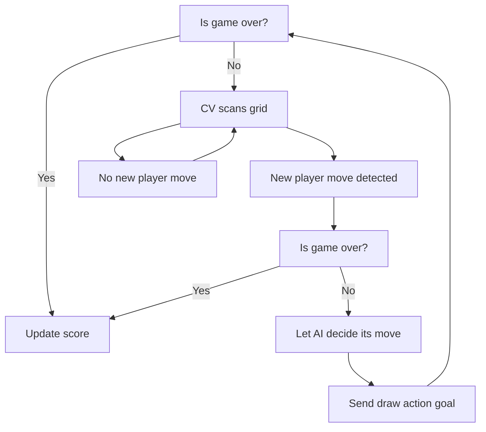
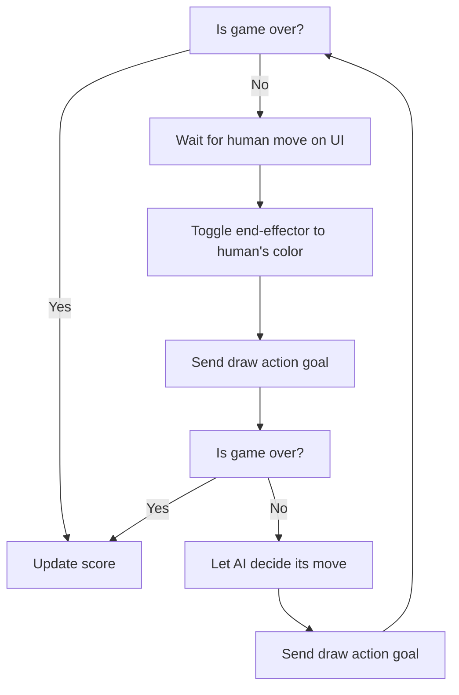

- [Project Overview](#project-overview)
- [System Architecture](#system-architecture)
  - [ROS Architecture](#ros-architecture)
  - [Package-level Architecture](#package-level-architecture)
  - [Behaviour Tree](#behaviour-tree)
    - [Player vs. Robot Game Mode](#player-vs-robot-game-mode)
    - [Robot vs. Robot Game Mode](#robot-vs-robot-game-mode)
  - [Node Description](#node-description)
  - [Custom Messages](#custom-messages)
- [Technical Components](#technical-components)
  - [Computer Vision](#computer-vision)
  - [Custom End-Effector](#custom-end-effector)
  - [System Visualisation](#system-visualisation)
  - [Closed-Loop Operation](#closed-loop-operation)
- [Installation and Setup](#installation-and-setup)
  - [Hardware Setup](#hardware-setup)
- [Running the System](#running-the-system)
  - [Expected Behaviour](#expected-behaviour)
- [Results and Demo](#results-and-demo)
- [Discussion and Future Work](#discussion-and-future-work)
- [Contributors and Roles](#contributors-and-roles)
- [Repository Structure](#repository-structure)
- [References and Acknowledgements](#references-and-acknowledgements)

## Project Overview
TODO

## System Architecture

### ROS Architecture

### Package-level Architecture

### Behaviour Tree

The system behaviour varies slightly depending on which player starts first and the gamemode chosen.

#### Player vs. Robot Game Mode


#### Robot vs. Robot Game Mode


### Node Description
**Brain Package**
- `keyboard_node`: Provides manual control interface via XTerm terminal for toggling logs, adjusting CV parameters, returning robot to home position, and triggering shutdown.
- `human_vs_robot`: Orchestrates human vs. AI gameplay by detecting human moves through CV, coordinating with the MENACE AI agent for robot moves, and managing game state through a Pygame UI.
- `robot_vs_robot`: Enables robot vs. robot gameplay where a human selects moves via mouse clicks for one player while the MENACE AI controls the other player, with both moves executed by the robot arm.

**Manipulation Package**
- `moveit_server`: Motion planning and execution server that handles path planning for drawing X's and O's, erasing the grid (future work), and managing collision avoidance using MoveIt with configurable constraints and trajectory parameters.

**Perception Package**
- `aruco_vision_node`: Detects ArUco markers to establish the grid coordinate frame, broadcasts TF transforms between camera and world frames, and publishes warped top-down grid images for cell detection.
- `cell_vision_node`: Processes warped grid images to detect X (blue) and O (red) symbols in each cell using HSV color filtering, publishes cell poses and states, and visualises detected symbols as RViz markers.

### Custom Messages
**Messages**
- `GridPose`: Contains a header, an array of `Pose2D` representing the center positions and orientations of all 9 grid cells in world coordinates, and an array of color codes indicating cell states (-1 = <span style="color:red">O</span>, 0 = empty, 1 = <span style="color:blue">X</span>).

**Services**
- `MoveRequest`: Service for requesting robot movements with a command type ("cartesian" or "joint"), an array of 6 position values, and a constraints identifier string. Returns a boolean success flag.

**Actions**
- `DrawShape`: Action for drawing X or O symbols on the grid. Takes a `Pose2D` target location, shape string ("X" or "O"), and constraints identifier as goal parameters. Provides status string and progress percentage as feedback, and returns success boolean with message upon completion.

## Technical Components

### Computer Vision
The vision pipeline consists of two stages working in tandem to enable autonomous gameplay:

**Stage 1 - Grid Localization (ArUco Vision)**
- Detects four ArUco markers positioned at the corners of the physical tic-tac-toe grid
- Computes the grid's center position (X / Y) and 2D rotation (yaw) using camera intrinsics and marker geometry
- Broadcasts a `grid_frame` TF transform linking the detected grid to the world coordinate system
- Applies perspective transformation to warp the camera image into a top-down view aligned with the grid
- Publishes the warped image for downstream cell analysis

**Stage 2 - Symbol Detection (Cell Vision)**
- Processes the warped grid image to analyse each cell independently
- Uses HSV colour space thresholding to detect blue markers (X) and red markers (O) within adaptive circular regions
- Implements a shrinking-radius algorithm that decreases the detection area until a single colour is confidently identified, reducing false positives from overlapping colors
- Applies morphological opening to filter noise and improve detection robustness
- Requires sustained detection over a configurable time window (default: 3 seconds at 80% confidence) before confirming a human move, preventing false triggers from transient occlusions
- Publishes cell poses in world coordinates and colour states (-1 = <span style="color:red">O</span>, 0 = empty, 1 = <span style="color:blue">X</span>) via the `GridPose` message
- Generates RViz markers overlaying detected symbols on the grid for real-time visualisation

The pipeline enables fully autonomous human move detection in the human vs. robot mode, eliminating the need for manual input devices.

### Custom End-Effector

### System Visualisation
The system uses RViz as the primary visualisation tool, providing real-time feedback on robot state, perception data, and coordinate frames:

**Robot Model & Planning**
- Displays the UR5e robot arm with custom end-effector using MoveIt's motion planning plugin
- Shows planned trajectories, collision geometry (table, walls, ceiling), and joint states
- Visualises path constraints and planning attempts during motion execution

**Perception Overlays**

- ArUco Markers: Black cubes with text labels (TL, BL, TR, BR) at detected corner positions
- Cell States: 3D mesh overlays (`X.STL`, `O.STL`) coloured blue or red rendered at each occupied cell's center
- Warped Grid: Real-time display of the perspective-corrected top-down grid image showing raw CV input

**Transform Tree**

- Complete TF tree showing relationships between `world`, `base_link`, `tool0`, `pen_holder`, `camera_rgb_optical_frame`, and `grid_frame`
- Enables visual verification of coordinate frame alignment

The visualisation configuration is stored in `tictactoe.rviz` and launches automatically with the system, providing operators with comprehensive situational awareness of the robot's perception and planning state.

### Closed-Loop Operation
The system implements closed-loop control through continuous vision-based state monitoring and adaptive decision-making:

**Vision-Based State Feedback**

- The perception pipeline continuously publishes grid state via the `GridPose` message
- Orchestrator/brain node maintains a sliding window buffer of recent observations for each cell
- Human moves are confirmed only when a cell consistently shows the same color state above the confidence threshold (80%), preventing false detections from shadows, occlusions, or transient noise

**Adaptive Game Flow**

- In human vs. robot mode, the system waits in a monitoring state during the human's turn, continuously processing vision data
- During robot motion, vision processing continues but move detection is suspended to prevent misclassification of the robot's own movements
- After the robot completes its move, the system returns to the monitoring state and awaits the next human input
- Once the game ends, the system updates scores and resets game state

## Installation and Setup

**Requirements**:
- ROS 2 Humble
- UR ROS2 Driver (`sudo apt-get install ros-humble-ur`)
- MoveIt (`sudo apt install ros-humble-moveit`)
- Python 3.x
- XTerm (`sudo apt install xterm`)

```bash
# Git
git clone git@github.com:AbdulShahzeb/mtrn4231-project.git
cd mtrn4231-project
pip3 install -r requirements.txt

# (Optional) Training Tic-Tac-Toe agents
cd src/brain
python3 scripts/train_menace.py --num-games 100000 --output-dir models/ # Adjust num-games as desired

# Bulding (Remember to cd to root dir)
colcon build --symlink-install
source install/setup.bash
```

### Hardware Setup


## Running the System
```bash
# Default: Play human vs. robot as X
ros2 launch brain tictactoe.launch.py

# Play human vs. robot as O
ros2 launch brain tictactoe.launch.py player:=o

# Play robot vs. robot as X
ros2 launch brain tictactoe.launch.py player:=x gamemode:=robot

# Play human vs. robot as X (same as default)
ros2 launch brain tictactoe.launch.py player:=x gamemode:=human
```

### Expected Behaviour

The launch command should launch:
- UR ROS2 Driver
- MoveIt
- RealSense node
- MoveIt server (manipulation node)
- CV nodes for ArUco and X/O detection
- XTerm window for keyboard commands
- Pygame UI showing empty grid
- RViz, pre-configured to include the following:
  - UR5e model
  - Collision boxes (walls and table)
  - End-effector
  - ArUco markers, if in camera frame
  - Cell states (X or O)
  - TF coordinate frames

## Results and Demo


## Discussion and Future Work


## Contributors and Roles
| Contributor | Role |
|---|---|
| Abdul |  |
| Dave |  |
| Leo |  |
| Florian |  |

## Repository Structure
```
mtrn4231-project/
├── src/
│   ├── brain/                      # High-level game logic and orchestration
│   │   ├── brain/                  # Python nodes for game management
│   │   │   ├── human_vs_robot.py   # Human vs AI game mode with CV move detection
│   │   │   ├── robot_vs_robot.py   # Robot vs robot game mode with mouse input
│   │   │   └── keyboard_node.py    # Manual control interface via terminal
│   │   ├── launch/                 # Launch files for system startup
│   │   ├── models/                 # Trained MENACE AI agent files (.npy)
│   │   ├── scripts/                # Script to train AI agents
│   │   ├── rviz/                   # RViz configuration files
│   │   └── config/                 # Robot calibration parameters
│   │
│   ├── manipulation/               # Motion planning and robot control
│   │   └── src/
│   │       └── moveit_server.cpp   # MoveIt server for drawing and erasing
│   │
│   ├── perception/                 # Computer vision and sensing
│   │   ├── perception/
│   │   │   ├── aruco_vision.py     # ArUco marker detection and grid localization
│   │   │   └── cell_vision.py      # Cell state detection (X/O recognition)
│   │   └── meshes/                 # 3D models for RViz visualization
│   │
│   ├── helper/                     # Custom message, service, and action definitions
│   │   ├── msg/                    # Custom message types (GridPose)
│   │   ├── srv/                    # Custom service types (MoveRequest)
│   │   └── action/                 # Custom action types (DrawShape, EraseGrid)
│   │
│   └── end_effector/               # Custom end-effector URDF and description
│       └── urdf/                   # Robot model with dual-marker end-effector
│
└── requirements.txt                # Python dependencies
```

## References and Acknowledgements
We would like to acknowledge Alex Cronin, our lab demonstrator, for his feedback and guidance throughout the project's development. We would like to thank Lachlan Wallbridge for his help with coordinate transforms and grid detection CV.
