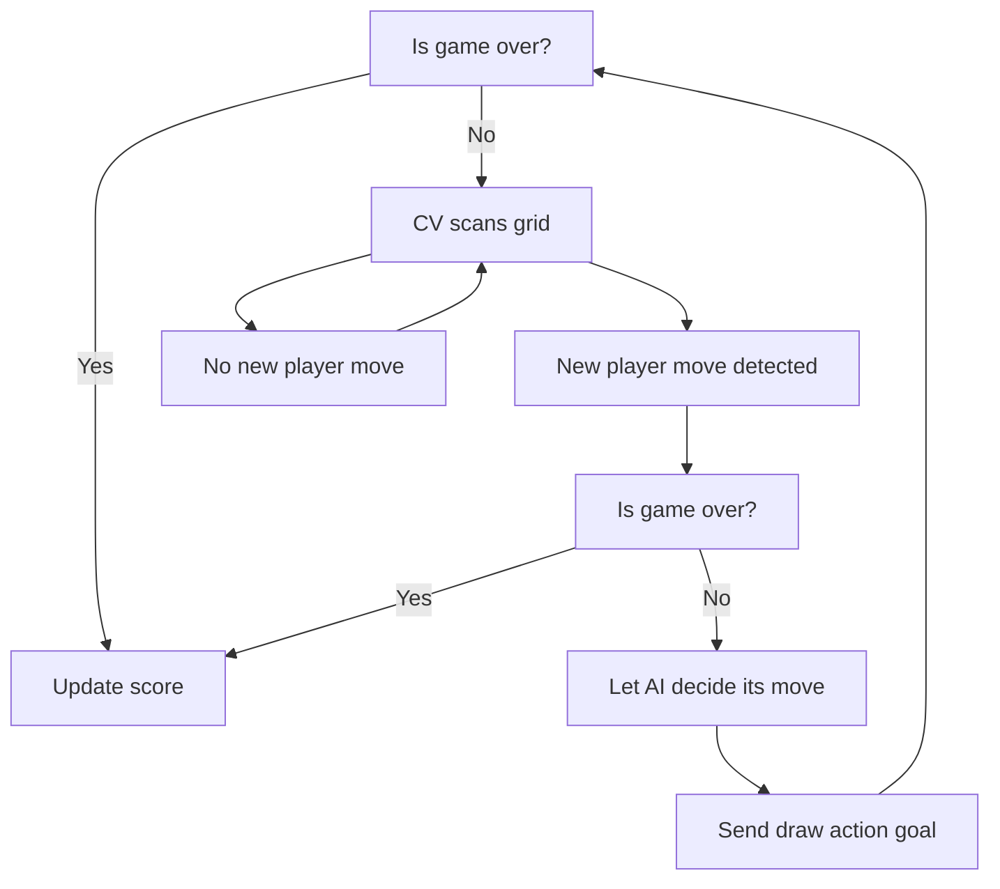
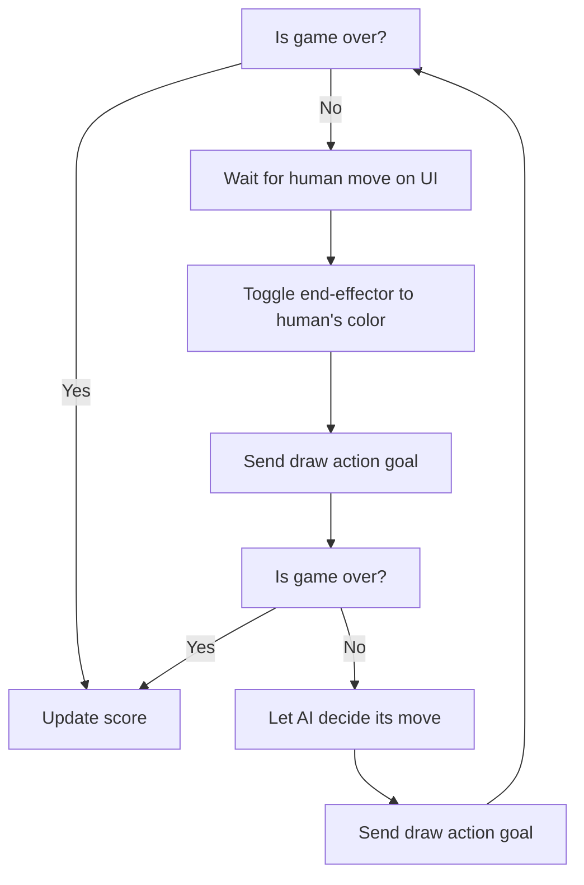

- [Project Overview](#project-overview)
- [System Architecture](#system-architecture)
  - [ROS Architecture](#ros-architecture)
  - [Package-level Architecture](#package-level-architecture)
  - [Behaviour Tree](#behaviour-tree)
    - [Player vs. Robot Game Mode](#player-vs-robot-game-mode)
    - [Robot vs. Robot Game Mode](#robot-vs-robot-game-mode)
  - [Node Description](#node-description)
  - [Custom Messages](#custom-messages)
- [Technical Components](#technical-components)
  - [Computer Vision](#computer-vision)
  - [Custom End-Effector](#custom-end-effector)
  - [System Visualisation](#system-visualisation)
  - [Closed-Loop Operation](#closed-loop-operation)
- [Installation and Setup](#installation-and-setup)
  - [Hardware Setup](#hardware-setup)
- [Running the System](#running-the-system)
  - [Expected Behaviour](#expected-behaviour)
- [Results and Demo](#results-and-demo)
- [Discussion and Future Work](#discussion-and-future-work)
- [Contributors and Roles](#contributors-and-roles)
- [Repository Structure](#repository-structure)
- [References and Acknowledgements](#references-and-acknowledgements)

## Project Overview
TODO

## System Architecture

### ROS Architecture

### Package-level Architecture

### Behaviour Tree

The system behaviour varies slightly depending on which player starts first and the gamemode chosen.

#### Player vs. Robot Game Mode


#### Robot vs. Robot Game Mode


### Node Description


### Custom Messages

## Technical Components

### Computer Vision

### Custom End-Effector

### System Visualisation

### Closed-Loop Operation

## Installation and Setup

**Requirements**:
- ROS 2 Humble
- UR ROS2 Driver (`sudo apt-get install ros-humble-ur`)
- MoveIt (`sudo apt install ros-humble-moveit`)
- Python 3.x
- XTerm (`sudo apt install xterm`)

```bash
# Git
git clone git@github.com:AbdulShahzeb/mtrn4231-project.git
cd mtrn4231-project
pip3 install -r requirements.txt

# (Optional) Training Tic-Tac-Toe agents
cd src/brain
python3 scripts/train_menace.py --num-games 100000 --output-dir models/ # Adjust num-games as desired

# Bulding (Remember to cd to root dir)
colcon build --symlink-install
source install/setup.bash
```

### Hardware Setup


## Running the System
```bash
# Default: Play human vs. robot as X
ros2 launch brain tictactoe.launch.py

# Play human vs. robot as O
ros2 launch brain tictactoe.launch.py player:=o

# Play robot vs. robot as X
ros2 launch brain tictactoe.launch.py player:=x gamemode:=robot

# Play human vs. robot as X (same as default)
ros2 launch brain tictactoe.launch.py player:=x gamemode:=human
```

### Expected Behaviour

The launch command should launch:
- UR ROS2 Driver
- MoveIt
- RealSense node
- MoveIt server (manipulation node)
- CV nodes for ArUco and X/O detection
- XTerm window for keyboard commands
- Pygame UI showing empty grid
- RViz, pre-configured to include the following:
  - UR5e model
  - Collision boxes (walls and table)
  - End-effector
  - ArUco markers, if in camera frame
  - Cell states (X or O)
  - TF coordinate frames

## Results and Demo


## Discussion and Future Work


## Contributors and Roles
| Contributor | Role |
|---|---|
| Abdul |  |
| Dave |  |
| Leo |  |
| Florian |  |

## Repository Structure


## References and Acknowledgements


